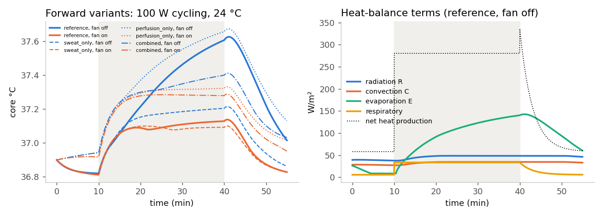
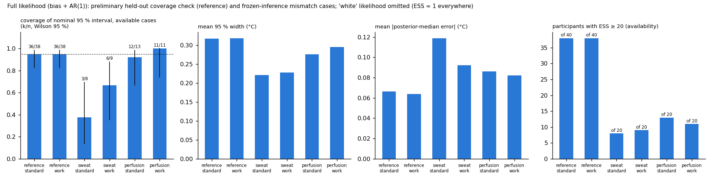

# Core Body Temperature Reconstruction Simulation

**Project by [anab028](https://github.com/anab028) · v14 final, revision 2**

A Python feasibility study of reconstructing **changes in core body temperature** from synthetic skin-temperature observations and heat-balance calculations. This repository contains the simulation work supporting a core body temperature prototype project.

**Status:** the preliminary synthetic study is frozen at v14. It includes a two-node thermoregulation model, reconstruction experiments, uncertainty analysis, nine figures, and saved numerical results. It does not include a physical sensor prototype, camera integration, machine learning, or human measurements.

## Research question

How much can skin-temperature observations tell us about core-temperature change when physiology and measurement errors are uncertain? Can controlled changes in workload or airflow improve the reconstruction?

The study models heat exchange between core and skin, simulates observations, and compares inferred core-temperature changes against the known synthetic truth. Its main inference target is core-temperature change at the end of exercise, 40 minutes into the session. The simulation supplies a baseline core temperature of 36.9 °C; it does not demonstrate measurement of an unknown absolute baseline.

## What has been completed

| Component | Work completed | Source / outputs |
|---|---|---|
| Thermal model | Two-node core/skin heat balance, convection, radiation, evaporation, skin blood flow, and reference/alternative physiology laws | `thermo.py` |
| Baseline reconstruction | Oracle bookkeeping, sensitivity analysis, candidate ensembles, accuracy sweeps, model mismatch, joint fan conditions, and held-out synthetic physiologies | `run_analysis.py`; figures 1–5 |
| Protocol comparison | Standard, fan-pulse, workload-swing, and combined protocols with matched observation windows and equal total external work | `run_ambiguity.py`; figure 6 |
| Robustness and mechanism | Paired comparisons across bank sizes, tolerances, seeds and participant sets; candidate removal/addition; observation-window ablation; biased/correlated noise | `run_mechanism.py`; figures 7–8 |
| Sensor-error inference | Likelihood with session bias and AR(1) noise, preliminary held-out interval coverage, effective sample size, and within-/cross-seed stability | `run_calibrated.py`; figure 9 |

## Main findings from the saved v14 results

- **Exact bookkeeping is possible with oracle inputs.** The original study reports agreement to about 1e-13. With fixed-gain reconstruction across 20 held-out reference physiologies, RMSE was about **0.35 °C with fan off and 0.31 °C with fan on**.
- **A good skin-temperature fit can hide core-temperature error.** The tested perfusion mismatch produced roughly **0.2 °C underestimation** in the rejection-ensemble analyses, including causal and retrospective fits.
- **A workload swing showed a small, conditional benefit under sweat-law mismatch.** Under the explicit sensor-error likelihood, paired mean absolute error decreased by **0.024 °C** at both 4,000 and 16,000 candidates. The common available sample changed from 8 to 14 participants, so availability and bank size matter.
- **A fan pulse did not demonstrate a benefit under the tested perfusion mismatch.** Paired error showed a small, non-uniform adverse tendency in the robustness experiments.
- **Reference-model coverage was encouraging but preliminary.** At 4,000 candidates, 36 of 38 available held-out reference cases were covered by the nominal 95% interval in each protocol (40 tested; Wilson interval approximately 0.83–0.99). This is not evidence of general calibration under physiology mismatch.
- **Numerical stability remains incomplete.** Five of 12 selected cases passed both within-seed and cross-seed criteria; seven remained unresolved. Effective sample size alone is not a convergence guarantee.

These are findings from the supplied frozen outputs. The complete experiments were not rerun during GitHub preparation. See the [original v14 study report](docs/V14_STUDY_REPORT.md) for experiment definitions, paired counts, corrections, detailed tables, and limitations.

## Example results





## Simulation setup

The standard synthetic session uses a 70 kg body with 1.8 m² surface area: 10 minutes of rest, 30 minutes of exercise at 100 W external workload, then 15 minutes of recovery. Ambient and mean radiant temperatures are 24 °C, relative humidity is 40%, and the time step is 2 seconds. Fan-off/fan-on airflow is 0.15/1.5 m/s.

The workload protocol replaces part of the 100 W segment with 50 W from minutes 27–32 and 150 W from minutes 32–37, preserving total external work. Candidate physiologies always use the reference laws; selected synthetic truths deliberately use different sweat or perfusion laws.

The explicit sensor model assumes session bias SD 0.5 °C, correlated noise SD 0.3 °C, and correlation time 60 seconds. These parameters are assumptions, not measurements from a real camera.

## Run locally

Use Python with NumPy and Matplotlib. The original release records Python 3.11.15, NumPy 2.4.4, and Matplotlib 3.10.9 in `out/MANIFEST.json`; `requirements.txt` installs available versions and is not an exact environment lock.

```bash
python3 -m venv .venv
source .venv/bin/activate
python -m pip install -r requirements.txt

python run_analysis.py
python run_ambiguity.py
python run_mechanism.py
python run_calibrated.py
```

On Windows, activate with `.venv\Scripts\activate` instead. Run scripts from the repository root. Each script writes its results under `out/` and can overwrite the supplied frozen outputs. Use a separate checkout if you want to compare reruns against the archived results. The original report estimates a few minutes per script; actual runtime depends on the machine.

The analysis scripts execute their experiments at module level, so importing a `run_*.py` script also starts its analysis. Import `thermo.py` for the reusable model functions.

## Repository guide

```text
thermo.py                    Core model and inverse reconstruction
run_analysis.py              Baseline, sensitivity and mismatch experiments
run_ambiguity.py             Matched protocol comparisons
run_mechanism.py             Paired robustness, mechanism and ablation
run_calibrated.py            Sensor-error likelihood, coverage and stability
requirements.txt            NumPy and Matplotlib dependencies
out/                         Nine PNG figures, four result JSONs, four logs,
                             and the original release manifest
docs/V14_STUDY_REPORT.md      Original detailed v14 README, unchanged
PREPARATION.md               Source provenance and preparation checks
```

The report was originally the release's root README, so its code and output paths are relative to the repository root. The manifest's `README.md` checksum refers to that original file, now preserved at `docs/V14_STUDY_REPORT.md`.

## Limitations and next steps

All participants, observations, physiology stress tests, and sensor errors are synthetic. No camera field-of-view or regional visibility model is included. Small sample counts, candidate-bank dependence, and unresolved posterior stability limit the conclusions. The workload effect is a mechanism demonstration with a small magnitude, not a validated device-performance claim.

The original study identifies the next phase as measuring actual thermal-camera error using a blackbody or phantom, replacing assumed noise parameters, and defining a human study protocol with the project supervisor. Those steps are outside this repository's completed work.

## Attribution and licensing

Project account: [anab028](https://github.com/anab028). The simulation source and frozen results come from `coretemp_sim_v14_final_rev2.zip`. Repository preparation adds this overview, dependency listing, ignore rules, and provenance notes; it does not modify the scientific Python code or saved results.

No open-source license has been selected for this release.
